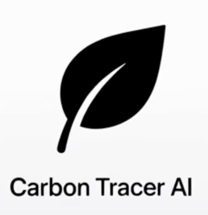

# Carbon Tracer AI 🌍

> Track your daily carbon footprint with AI-powered scanning, GPS transport tracking, and energy monitoring.

An intelligent greenhouse gas tracker built for the **Gemini 3 Hackathon** — powered by Google's Gemini Vision API.




## 🚀 Features

### 📸 Smart Scanning (4 Modes)
- **Product Mode** — Scan electronics, household items, clothing
- **Food Mode** — Analyze groceries, meals, and ingredients
- **Receipt Mode** — Extract items from shopping receipts
- **Barcode Mode** — Instant lookup via Open Food Facts database

### 🚗 Transport Tracking
- GPS-based automatic trip detection
- Speed-based transport mode recognition (walk/bike/car/transit)
- One-tap confirmation for detected trips
- Manual trip entry with Places API location autocomplete
- Multi-mode comparison (walk/bike/car/bus/train/carpool) with real Google Maps routes
- ✈️ Flight emissions via Google Travel Impact Model API (auto-discovers flights when no flight number provided)

### ⚡ Energy Monitoring
- Log electricity, natural gas, and heating oil usage
- Daily/weekly/monthly period tracking
- Carbon calculations with emission factors

### 📊 Insights & Gamification
- Daily carbon budget with circular progress
- Weekly stats with category breakdowns
- Streak tracking and achievement badges
- AI-generated personalized insights
- Week-over-week comparisons

### 💡 Carbon Coach
- Gemini-powered personalized recommendations
- Greener alternatives for scanned items
- Eco Score ratings (0-100%)

### 📤 Data Export
- Export your data as CSV or JSON
- Share via system share sheet

---

## 🛠 Tech Stack

### Core
- **Expo SDK 54** (Managed Workflow) with TypeScript
- **React Navigation 7** (Bottom Tabs + Stack)
- **React Native 0.81**

### Google APIs
| API | Purpose |
|-----|---------|
| **Gemini Vision API** | Image analysis, object detection, carbon estimation |
| **Google Maps Directions API** | Route calculation for transport |
| **Google Maps Places API (New)** | Location search & details |
| **Travel Impact Model API** | Accurate flight carbon emissions |

### Expo Modules
- `expo-camera` — Camera functionality
- `expo-barcode-scanner` — Barcode detection
- `expo-location` — GPS tracking
- `expo-image-picker` — Photo library access
- `expo-file-system` — File operations
- `expo-sharing` — Data export sharing
- `expo-notifications` — Budget alerts & reminders
- `@react-native-async-storage/async-storage` — Local persistence

---

## 📱 Screens

| Screen | Description |
|--------|-------------|
| **Home** | Daily carbon budget dashboard, category cards, streak counter, recent activity |
| **Scan** | Camera with 4 scan modes, text context input, quantity selector |
| **Item Detail** | Lifecycle breakdown, Eco Score, alternatives, add to log |
| **Journey** | Daily/weekly activity log grouped by category |
| **Stats** | Weekly charts, category breakdown, achievements, AI insights |
| **Transport** | GPS trip tracking, manual trip entry with Places search, multi-mode comparison, flight emissions |
| **Energy** | Electricity/gas/heating oil logging |
| **Coach** | AI-powered personalized recommendations |
| **History** | All past scans with detailed breakdowns |
| **Profile** | Settings, data export, app info |

---

## 📱 Getting Started

### Prerequisites

- Node.js 18+
- npm or yarn
- Expo Go app on your iOS/Android device
- Google API keys (optional — falls back to mock data)

### Installation

1. **Clone the repository**
   ```bash
   git clone https://github.com/hanyumasonliu/Ecoleoai.git
   cd Ecoleoai
   ```

2. **Install dependencies**
   ```bash
   npm install
   ```

3. **Set up environment variables**
   
   Create a `.env` file in the project root:
   ```env
   EXPO_PUBLIC_GEMINI_API_KEY=your_gemini_api_key_here
   EXPO_PUBLIC_GOOGLE_MAPS_API_KEY=your_google_maps_api_key_here
   ```
   
   Get your API keys:
   - Gemini: https://makersuite.google.com/app/apikey
   - Google Maps: https://console.cloud.google.com/apis/credentials

4. **Start the development server**
   ```bash
   npx expo start
   ```

5. **Run on your device**
   - Scan the QR code with Expo Go (Android) or Camera app (iOS)
   - Or press `i` for iOS simulator, `a` for Android emulator

---

## 🔧 Configuration

### Environment Variables

| Variable | Description | Required |
|----------|-------------|----------|
| `EXPO_PUBLIC_GEMINI_API_KEY` | Google Gemini API key for AI analysis | No (falls back to mock data) |
| `EXPO_PUBLIC_GOOGLE_MAPS_API_KEY` | Google Maps API key for directions & places | No (falls back to estimates) |

### Google Cloud APIs to Enable

If using your own API keys, enable these APIs in Google Cloud Console:
- Generative Language API (Gemini)
- Maps SDK for iOS / Android
- Directions API
- Places API (New)
- Travel Impact Model API

---

## 📂 Project Structure

```
src/
├── components/           # Reusable UI components
│   ├── CarbonBadge.tsx
│   ├── HistoryItem.tsx
│   ├── QuantitySelector.tsx
│   ├── ScanButton.tsx
│   └── ScanResultList.tsx
│
├── screens/              # App screens (11 total)
│   ├── HomeScreen.tsx
│   ├── ScanScreen.tsx
│   ├── ItemDetailScreen.tsx
│   ├── JourneyScreen.tsx
│   ├── StatsScreen.tsx
│   ├── TransportScreen.tsx
│   ├── EnergyScreen.tsx
│   ├── CoachScreen.tsx
│   ├── HistoryScreen.tsx
│   └── ProfileScreen.tsx
│
├── services/             # API & business logic
│   ├── gemini.ts         # Gemini Vision API integration
│   ├── maps.ts           # Google Maps Directions & Places
│   ├── travelImpact.ts   # Flight emissions calculator
│   ├── barcode.ts        # Barcode lookup (Open Food Facts)
│   ├── location.ts       # GPS tracking
│   ├── notifications.ts  # Push notifications
│   ├── storage.ts        # AsyncStorage wrappers
│   ├── export.ts         # CSV/JSON export
│   └── dataLayer.ts      # Data aggregation
│
├── context/              # React Context providers
│   ├── CarbonContext.tsx # Daily budget state
│   └── HistoryContext.tsx
│
├── data/
│   └── carbonDatabase.ts # Local carbon factors database
│
├── types/                # TypeScript definitions
│   ├── carbon.ts
│   ├── activity.ts
│   └── user.ts
│
├── hooks/
│   └── useCamera.ts
│
├── navigation/
│   └── RootNavigator.tsx
│
└── theme/
    ├── colors.ts
    ├── typography.ts
    └── index.ts
```

---

## 🎯 Usage

### Scanning Items
1. Open the app → **Scan** tab
2. Select mode: Product / Food / Receipt / Barcode
3. Point camera and tap **Scan**
4. View carbon breakdown with Eco Score
5. Adjust quantity and tap **Add to Log**

### Tracking Transport
1. Go to **Journey** → **Log Transport**
2. Enable GPS tracking to auto-detect trips
3. Confirm detected trips with one tap
4. Or manually enter flights with airport codes

### Monitoring Energy
1. Go to **Journey** → **Log Energy**
2. Select energy type (electricity/gas/heating)
3. Enter usage amount and period
4. View carbon impact

### Viewing Stats
- **Stats** tab shows weekly progress
- Category breakdown by Food/Transport/Products/Energy
- Achievement badges for milestones
- AI-generated weekly insights

---

## 🌍 Carbon Data

### Lifecycle Analysis
Carbon estimates include:
- Raw material extraction
- Manufacturing processes
- Transportation
- Usage phase
- End-of-life disposal

### Severity Levels
| Level | CO₂e Range | Meaning |
|-------|------------|---------|
| 🟢 Low | < 10 kg | Relatively eco-friendly |
| 🟡 Medium | 10-100 kg | Moderate impact |
| 🔴 High | > 100 kg | Significant footprint |

### Daily Budget
Default target: **8 kg CO₂e/day** (based on 3 tonnes/year sustainable target)

---

## 🤖 AI Models

The app uses Gemini 3 models with automatic fallback (required for [Gemini 3 Hackathon](https://gemini3.devpost.com/)):

1. `gemini-3-flash-preview` (primary - Gemini 3)
2. `gemini-2.5-flash` (fallback)
3. `gemini-2.0-flash` (secondary fallback)

Falls back to mock data if no API key is configured.

---

## 🏗 Building for Production

```bash
# Install EAS CLI
npm install -g eas-cli

# Configure EAS
eas build:configure

# Build for iOS
eas build --platform ios

# Build for Android
eas build --platform android
```

---

## 🏆 Hackathon

Built for the **Gemini 3 Hackathon** — showcasing Google's Gemini Vision API for environmental awareness and sustainable lifestyle choices.

### Google APIs Demonstrated
- ✅ Gemini Vision API for intelligent image analysis
- ✅ Travel Impact Model API for accurate flight emissions
- ✅ Maps APIs for transport route calculations

---

## 📄 License

MIT License — feel free to use this for your own projects.

---

Made with 💚 for a greener future
